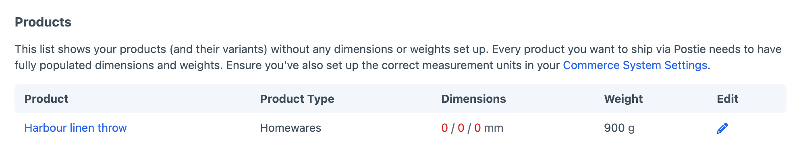
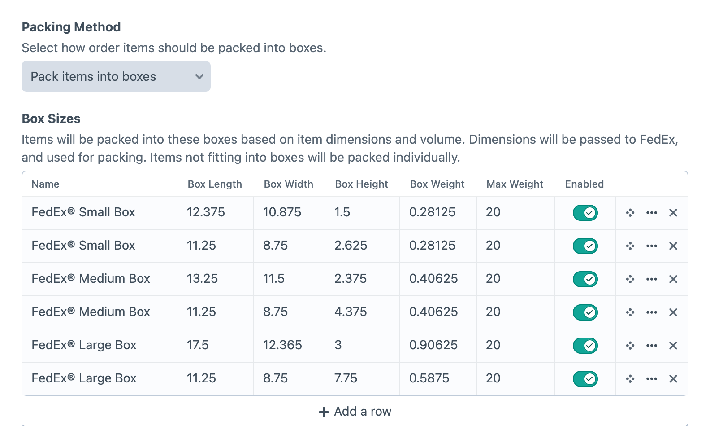
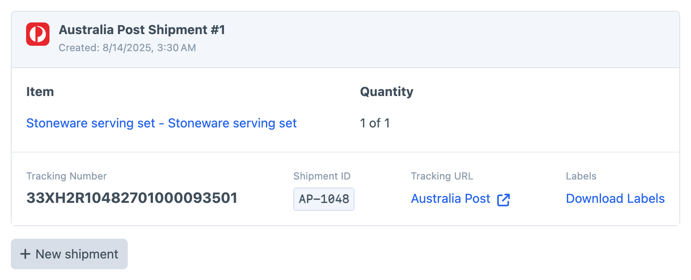

<!-- feature-intro -->
Fetch shipping rates, lodge shipments, generate labels and track deliveries with the carriers that fulfil your Craft Commerce orders. Requires Craft Commerce Pro.
<!-- feature-intro-end -->

<!-- feature-logo-grid -->
## Available providers

Connect one or more supported carriers for live checkout quotes. Postie is built to be extended too, so a project can add the provider it needs.

-  **Aramex**
-  **Aramex Australia**
-  **Australia Post**
-  **Bring**
-  **Canada Post**
-  **Colissimo**
-  **DHL Express**
-  **Fastway**
-  **FedEx**
-  **Interparcel**
-  **New Zealand Post**
-  **PostNL**
-  **Royal Mail**
-  **Sendle**
-  **TNT Australia**
-  **UPS**
-  **USPS**
<!-- feature-logo-grid-end -->

<!-- feature-media media-size="large" -->
## Catch missing measurements

Accurate rates start with accurate products. Postie points out variants that are missing dimensions or weight, so you can fix the gaps before a customer reaches checkout.

<!-- feature-media-end -->

<!-- feature-section media-size="large" -->
## Box-packing management

Ensure your customers’ products are packed as efficiently as possible by defining the box dimensions and weights your store keeps on hand. Pack every item separately, treat the order as one parcel, or use volume-based packing to match products against provider and custom boxes.

<!-- feature-section-end -->

<!-- feature-media media-size="large" -->
## Shipment tracking and fulfilment

Fulfil an order the way stock actually leaves the warehouse. Lodge selected line items and quantities, keep several shipments against one Commerce order, download printable labels and give customers carrier-aware tracking information. Postie can move the order through partially shipped and shipped statuses as fulfilment progresses.

<!-- feature-media-end -->

<!-- feature-grid -->
- :icon[receipt-dollar] **Packing allowances** Add a flat or percentage markup to cover packing and handling costs.
- :icon[test-pipe] **Rates testing** Check origin, destination and parcel details against a provider before relying on its quote at checkout.
- :icon[bug] **Debug details** Inspect Postie requests and responses in Craft’s Debug Toolbar when a quote needs investigating.
- :icon[settings] **Control panel or configuration** Manage provider settings in Craft or keep them alongside the rest of a multi-environment project’s configuration.
- :icon[route] **Delivery progress** Fetch shipment status and journey summaries from carriers that support tracking updates.
- :icon[api] **Your own provider** Register project-specific carriers and adjust rate, packing and provider behaviour through documented events.
<!-- feature-grid-end -->
